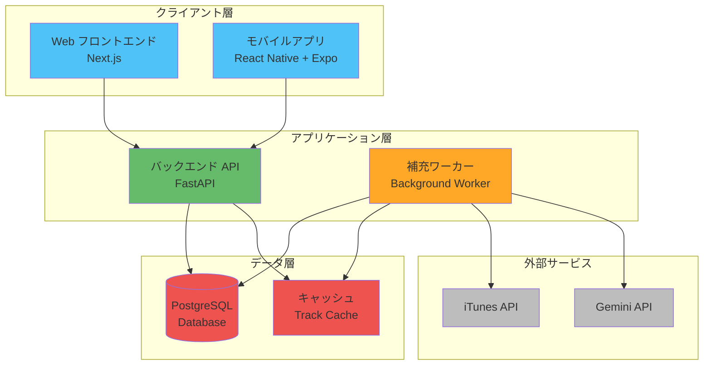
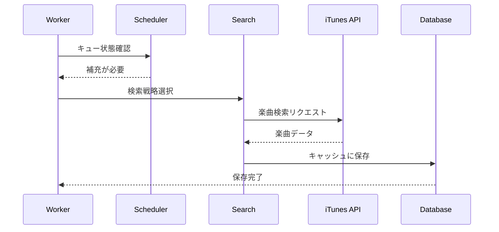
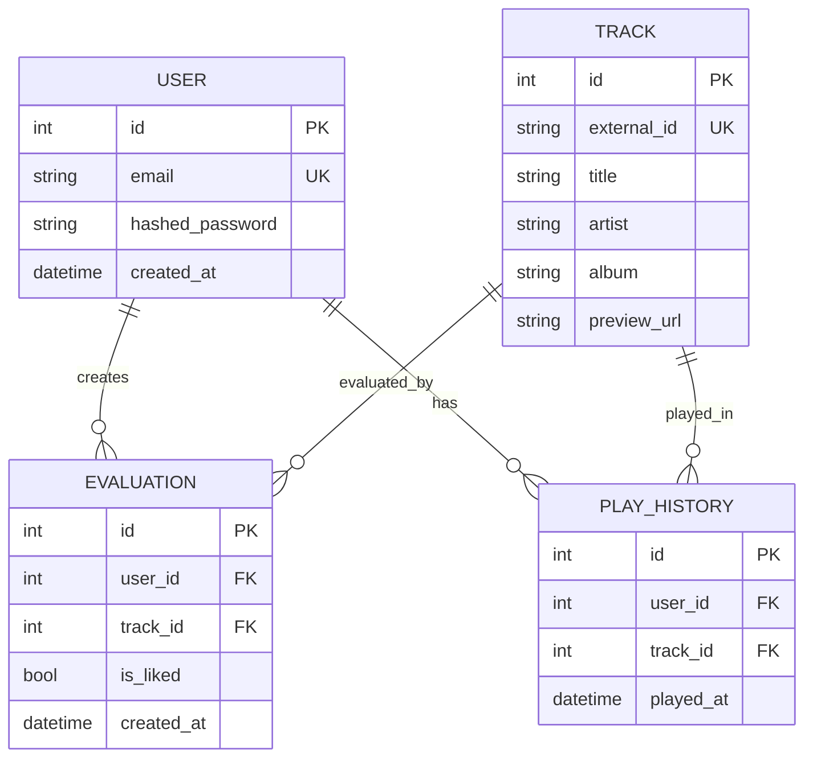
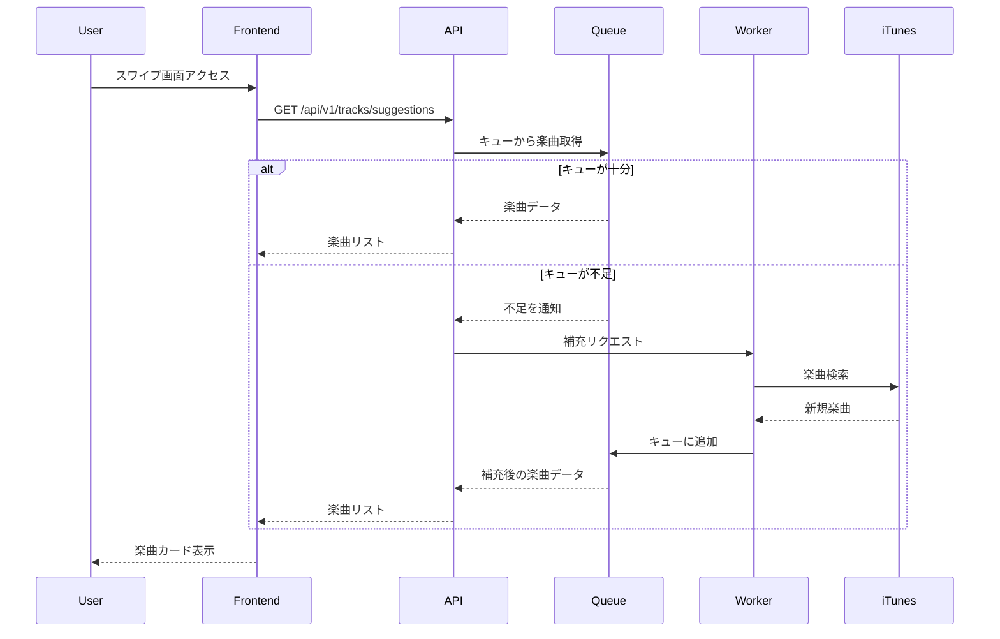
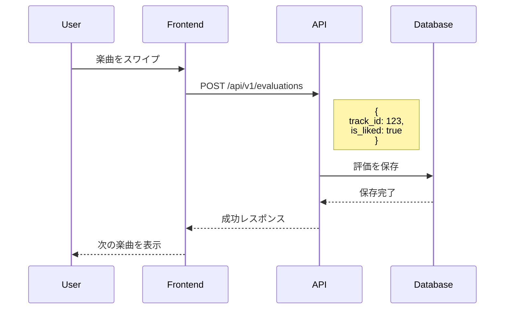
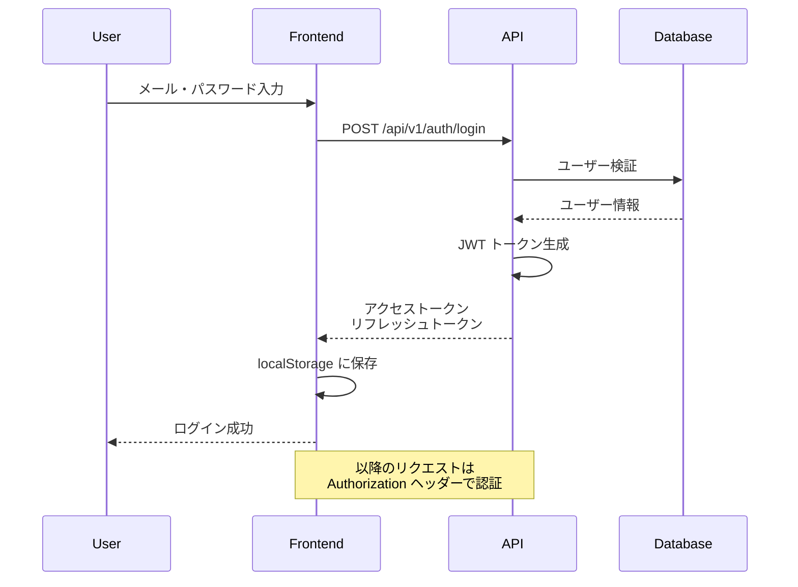
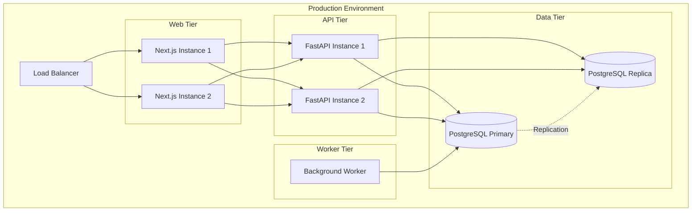
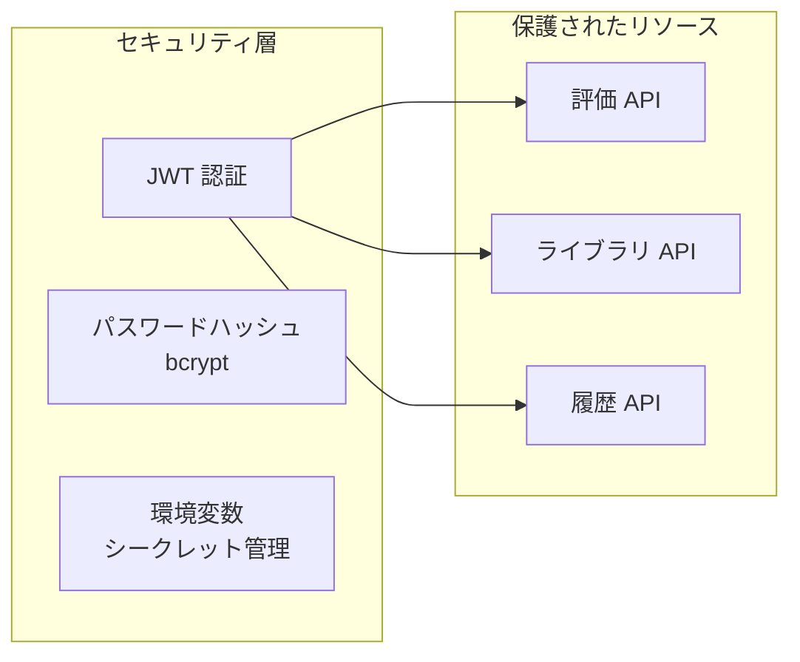
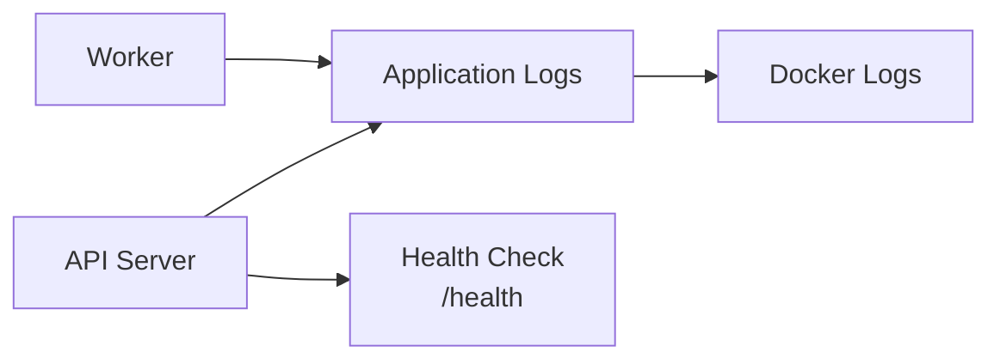

# otodoki2 アーキテクチャ

このドキュメントでは、otodoki2 のシステムアーキテクチャを説明します。

## システム全体構成



## コンポーネント詳細

### クライアント層

#### Web フロントエンド (Next.js)

- **技術スタック**: Next.js 14 (App Router), React, TypeScript
- **主要機能**:
  - ユーザー認証 (JWT)
  - スワイプ UI による楽曲評価
  - 楽曲ライブラリ管理
  - オーディオプレビュー再生

#### モバイルアプリ (React Native + Expo)

- **技術スタック**: React Native, Expo, TypeScript
- **主要機能**:
  - Web 版と同様の機能をモバイルで提供
  - ネイティブジェスチャーサポート
  - オフライン対応 (AsyncStorage)

### アプリケーション層

#### バックエンド API (FastAPI)

```mermaid
graph LR
    subgraph "API エンドポイント"
        AUTH[/auth/*<br/>認証]
        TRACKS[/tracks/*<br/>楽曲]
        EVAL[/evaluations/*<br/>評価]
        HIST[/history/*<br/>履歴]
    end
    
    subgraph "ビジネスロジック"
        SCHED[Scheduler<br/>Service]
        QUEUE[Queue<br/>Service]
        SEARCH[Search<br/>Service]
    end
    
    AUTH --> SCHED
    TRACKS --> QUEUE
    TRACKS --> SEARCH
    EVAL --> QUEUE
    HIST --> QUEUE
```

**主要エンドポイント**:
- `POST /api/v1/auth/register` - ユーザー登録
- `POST /api/v1/auth/login` - ログイン
- `GET /api/v1/tracks/suggestions` - 楽曲推薦
- `POST /api/v1/evaluations` - 評価登録
- `POST /api/v1/history/played` - 再生履歴記録

#### 補充ワーカー (Background Worker)



**機能**:
- iTunes API からの自動楽曲取得
- PostgreSQL へのキャッシュ
- 検索戦略の動的選択 (Genre-Based, Keyword-Based)
- Gemini API によるキーワード生成

### データ層

#### PostgreSQL Database

**主要テーブル**:



#### キャッシュ

- トラックデータを PostgreSQL にキャッシュ
- 重複検索を防止し、API コールを削減
- `external_id` でユニーク管理

### 外部サービス

#### iTunes API

- 楽曲メタデータの取得
- プレビュー URL の提供
- 検索クエリ: ジャンル、キーワード、アーティスト

#### Gemini API

- AI によるキーワード生成
- 検索クエリの多様化
- オプショナル (開発環境ではダミー値可)

## データフロー

### 楽曲推薦フロー



### 評価登録フロー



### 認証フロー



## デプロイメント構成



## スケーラビリティ

### 水平スケーリング

- **Web/API**: Docker コンテナで複数インスタンスを起動可能
- **Worker**: 複数ワーカーで並行処理
- **Database**: PostgreSQL レプリケーションでリードスケール

### 垂直スケーリング

- コンテナのリソース制限調整
- データベースのスペック向上

## セキュリティ



**セキュリティ対策**:
- JWT によるステートレス認証
- bcrypt によるパスワードハッシュ
- 環境変数でのシークレット管理
- CORS 設定による API アクセス制御

## パフォーマンス最適化

1. **キャッシュ戦略**:
   - トラックデータの PostgreSQL キャッシュ
   - 重複検索の削減

2. **非同期処理**:
   - FastAPI の非同期エンドポイント
   - SQLModel による非同期 DB アクセス

3. **バックグラウンドワーカー**:
   - ユーザーリクエストをブロックしない楽曲補充
   - スケジューラーによる効率的な補充タイミング

## 監視とロギング



**ログ確認**:
```bash
# API ログ
docker compose logs -f api

# ワーカーログ
docker compose logs -f worker

# すべてのログ
docker compose logs --tail=200
```

## 関連ドキュメント

- [WORKER_README.md](./WORKER_README.md) - バックグラウンドワーカーの詳細
- [DEPLOYMENT.md](./DEPLOYMENT.md) - デプロイメント手順
- [VISUAL_GUIDE.md](./VISUAL_GUIDE.md) - ビジュアルガイド
- [メイン README](../README.md) - プロジェクト概要

## 今後の改善点

- [ ] Redis によるセッションキャッシュ
- [ ] Elasticsearch による高度な楽曲検索
- [ ] WebSocket によるリアルタイム通知
- [ ] CDN による静的コンテンツ配信
- [ ] レート制限の実装
