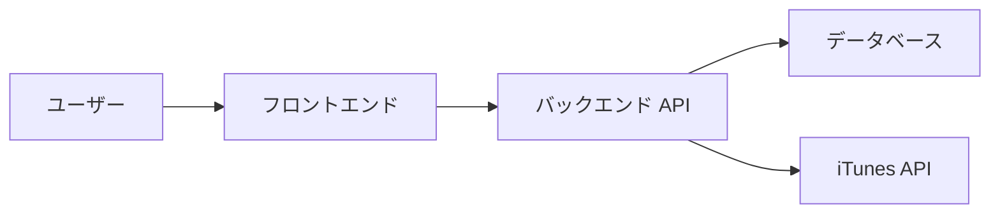
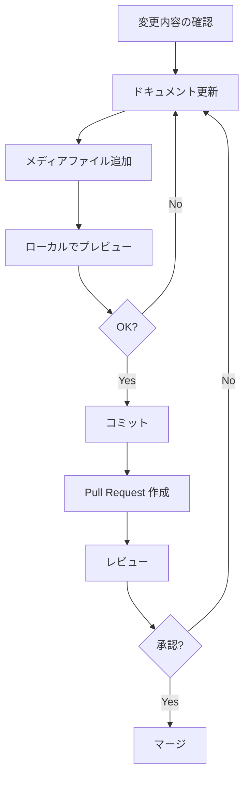

# ドキュメント貢献ガイド

otodoki2 プロジェクトのドキュメントに貢献していただきありがとうございます！このガイドでは、ドキュメントの追加・更新方法について説明します。

## 目次

- [ドキュメントの種類](#ドキュメントの種類)
- [ドキュメント構造](#ドキュメント構造)
- [スクリーンショットの追加](#スクリーンショットの追加)
- [動画の追加](#動画の追加)
- [図・ダイアグラムの追加](#図ダイアグラムの追加)
- [Markdown スタイルガイド](#markdown-スタイルガイド)
- [レビュープロセス](#レビュープロセス)

## ドキュメントの種類

otodoki2 では以下の種類のドキュメントを管理しています：

### 1. README ドキュメント

- **ルート README.md**: プロジェクト全体の概要とクイックスタート
- **各ディレクトリの README.md**: そのディレクトリの説明

### 2. 技術ドキュメント

- **API.md**: API 仕様とエンドポイント詳細
- **WORKER_README.md**: バックグラウンドワーカーの実装
- **AUDIO_PREVIEW_IMPLEMENTATION.md**: 音声プレビュー機能の実装
- **mobile-implementation.md**: モバイルアプリの実装

### 3. 運用ドキュメント

- **DEPLOYMENT.md**: デプロイメント手順
- **VISUAL_GUIDE.md**: ビジュアルガイド（スクリーンショット・動画付き）

### 4. 開発者ガイド

- **AGENTS.md**: AI エージェント向けの指示（各ディレクトリに配置）

## ドキュメント構造

```
otodoki2/
├── README.md                # プロジェクト全体の README
├── docs/                    # ドキュメントディレクトリ
│   ├── README.md           # ドキュメント目次
│   ├── VISUAL_GUIDE.md     # ビジュアルガイド
│   ├── CONTRIBUTING_DOCS.md # このファイル
│   ├── API.md              # API ドキュメント
│   ├── DEPLOYMENT.md       # デプロイメントガイド
│   ├── WORKER_README.md    # ワーカードキュメント
│   ├── images/             # 図・ダイアグラム
│   ├── screenshots/        # スクリーンショット
│   └── videos/             # 動画・GIF
└── [各ディレクトリ]/
    └── AGENTS.md           # AI エージェント向け指示
```

## スクリーンショットの追加

### 1. スクリーンショットの撮影

アプリケーションの主要な画面をキャプチャします。

**推奨設定:**
- **解像度**: 1920x1080 または 1280x720
- **ファイル形式**: PNG
- **最大サイズ**: 500KB

**撮影のポイント:**
- UI が見やすいように適切なズームレベルで撮影
- 個人情報やテストデータは含めない
- ブラウザのデベロッパーツールは閉じる
- 画面全体または機能に焦点を当てた範囲を撮影

### 2. ファイルの配置

```bash
# docs/screenshots/ ディレクトリに配置
cp ~/Downloads/screenshot.png docs/screenshots/feature-name.png
```

### 3. 画像の最適化

サイズが大きい場合は圧縮ツールを使用：

```bash
# ImageMagick を使用した圧縮例
convert original.png -quality 85 -resize 1920x1080\> optimized.png

# または TinyPNG などのオンラインツールを使用
# https://tinypng.com/
```

### 4. ドキュメントへの埋め込み

```markdown
## 機能名


*図1: 機能名の画面*
```

## 動画の追加

### 1. 動画の録画

**推奨ツール:**
- **macOS**: QuickTime Player, Screen Studio
- **Windows**: Xbox Game Bar, OBS Studio
- **Linux**: SimpleScreenRecorder, OBS Studio
- **Web ベース**: [Loom](https://www.loom.com/)

**推奨設定:**
- **解像度**: 1280x720
- **フレームレート**: 30 fps
- **長さ**: 30-60 秒
- **音声**: オプション（必要に応じて）

### 2. 動画の編集

不要な部分をカットし、適切な長さに編集します。

**推奨ツール:**
- FFmpeg (コマンドライン)
- DaVinci Resolve (無料版)
- Shotcut (オープンソース)

```bash
# FFmpeg での動画カット例
ffmpeg -i input.mp4 -ss 00:00:05 -t 00:00:30 -c copy output.mp4
```

### 3. GIF への変換（オプション）

軽量な GIF アニメーションに変換する場合：

```bash
# FFmpeg を使用した GIF 変換
ffmpeg -i input.mp4 -vf "fps=15,scale=800:-1:flags=lanczos" -c:v gif output.gif

# または ezgif.com などのオンラインツールを使用
```

### 4. ファイルの配置

```bash
# docs/videos/ ディレクトリに配置
cp ~/Downloads/demo.mp4 docs/videos/feature-demo.mp4
# または GIF の場合
cp ~/Downloads/demo.gif docs/videos/feature-demo.gif
```

### 5. ドキュメントへの埋め込み

**MP4 動画 (GitHub):**

```markdown
## 機能デモ

https://user-images.githubusercontent.com/YOUR_USER_ID/VIDEO_ID/feature-demo.mp4

*動画1: 機能のデモンストレーション*
```

**GIF アニメーション:**

```markdown
## 機能デモ


*動画1: 機能のデモンストレーション*
```

## 図・ダイアグラムの追加

### 1. 図の作成

**推奨ツール:**
- **フローチャート**: [draw.io](https://draw.io/), [Mermaid](https://mermaid.js.org/)
- **ER 図**: [dbdiagram.io](https://dbdiagram.io/)
- **アーキテクチャ図**: [draw.io](https://draw.io/), [Excalidraw](https://excalidraw.com/)

### 2. Mermaid を使用した図（推奨）

Markdown 内で直接記述できる Mermaid を推奨します：

```markdown
## システムフロー


```

### 3. 画像ファイルとして保存

draw.io などで作成した図を画像として保存する場合：

**推奨設定:**
- **ファイル形式**: SVG (ベクター) または PNG
- **解像度** (PNG): 1920x1080 以下

### 4. ファイルの配置

```bash
# docs/images/ ディレクトリに配置
cp ~/Downloads/diagram.svg docs/images/system-architecture.svg
```

### 5. ドキュメントへの埋め込み

```markdown
## システムアーキテクチャ


*図1: otodoki2 のシステムアーキテクチャ*
```

## Markdown スタイルガイド

### 基本ルール

1. **見出し**: `#` で階層構造を表現
   ```markdown
   # 大見出し (H1)
   ## 中見出し (H2)
   ### 小見出し (H3)
   ```

2. **リスト**:
   ```markdown
   - 箇条書き
   - 項目2
     - ネストした項目
   
   1. 番号付きリスト
   2. 項目2
   ```

3. **コードブロック**:
   ````markdown
   ```bash
   make up
   ```
   
   ```python
   def hello():
       print("Hello, World!")
   ```
   ````

4. **リンク**:
   ```markdown
   [リンクテキスト](URL)
   [内部リンク](./other-doc.md)
   ```

5. **画像**:
   ```markdown
   
   ```

6. **テーブル**:
   ```markdown
   | 列1 | 列2 | 列3 |
   | --- | --- | --- |
   | A   | B   | C   |
   ```

### 日本語スタイル

- **句読点**: 「、」と「。」を使用
- **括弧**: 全角括弧「（）」を使用
- **英数字**: 半角を使用
- **スペース**: 日本語と英数字の間にスペースを入れる（推奨）
  ```markdown
  otodoki2 は FastAPI で構築されています。
  ```

### ドキュメント構造

各ドキュメントには以下を含めることを推奨：

1. **タイトル** (H1)
2. **概要**: ドキュメントの目的と内容の簡潔な説明
3. **目次** (オプション): 長いドキュメントの場合
4. **本文**: 適切な見出しで構造化
5. **参考リンク**: 関連ドキュメントへのリンク

## レビュープロセス

### 1. ドキュメント更新の流れ



### 2. チェックリスト

Pull Request を作成する前に以下を確認してください：

- [ ] ドキュメントの内容が正確で最新である
- [ ] Markdown 構文が正しい（プレビューで確認）
- [ ] スクリーンショットが適切なサイズと形式である
- [ ] 動画が推奨サイズ以下である
- [ ] ファイル名が命名規則に従っている
- [ ] 個人情報やセンシティブな情報が含まれていない
- [ ] リンクが正しく機能する
- [ ] 関連ドキュメント (README.md など) も更新されている

### 3. Pull Request の作成

```bash
# ブランチを作成
git checkout -b docs/update-visual-guide

# 変更をコミット
git add docs/
git commit -m "docs: ビジュアルガイドにスクリーンショットを追加"

# プッシュ
git push origin docs/update-visual-guide
```

Pull Request のタイトルには `docs:` プレフィックスを使用します：

```
docs: スワイプ機能のデモ動画を追加
docs: API ドキュメントを更新
docs: README にセットアップ手順を追記
```

### 4. レビューのポイント

レビュアーは以下を確認します：

- ドキュメントの正確性
- 内容の完全性
- Markdown の適切な使用
- メディアファイルの品質とサイズ
- スタイルガイドの遵守

## よくある質問

### Q1: スクリーンショットに個人情報が含まれてしまう場合は？

A: テスト用のダミーデータを使用するか、画像編集ツールでモザイクやぼかし処理を施してください。

### Q2: 動画のサイズが大きすぎる場合は？

A: 以下の方法でサイズを削減できます：
- 解像度を下げる (720p に変更)
- フレームレートを下げる (15-20 fps)
- GIF に変換する
- 動画の長さを短くする

### Q3: Mermaid の図が表示されない場合は？

A: GitHub では Mermaid がサポートされていますが、他のプラットフォームでは画像として保存する必要があります。

### Q4: 既存のドキュメントを大幅に変更したい場合は？

A: まず Issue を作成して変更内容を提案し、コミュニティの意見を聞くことを推奨します。

## 参考リンク

- [GitHub Markdown ガイド](https://docs.github.com/ja/get-started/writing-on-github/getting-started-with-writing-and-formatting-on-github/basic-writing-and-formatting-syntax)
- [Mermaid ドキュメント](https://mermaid.js.org/)
- [VISUAL_GUIDE.md](./VISUAL_GUIDE.md)
- [メイン README](../README.md)

## フィードバック

このガイドに関する質問や改善提案は、GitHub Issue でお知らせください。
