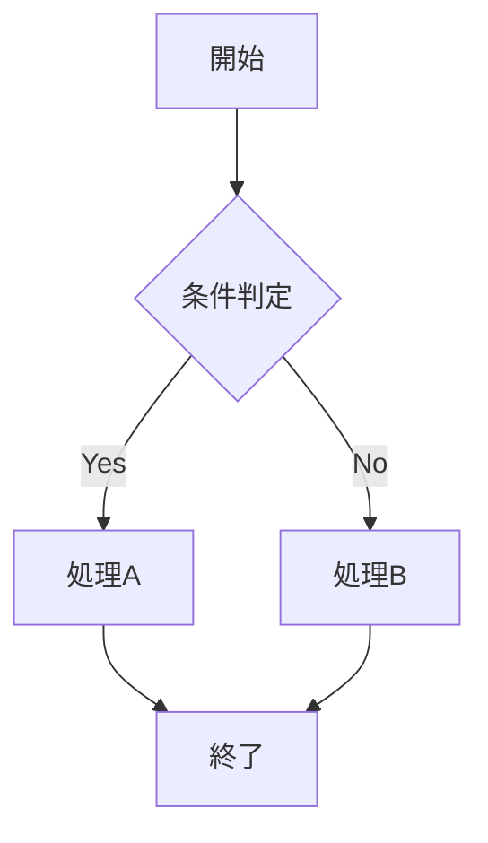
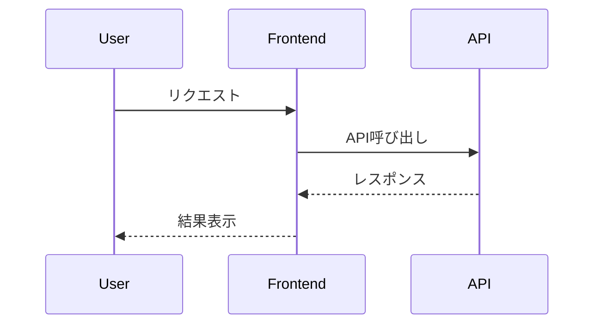
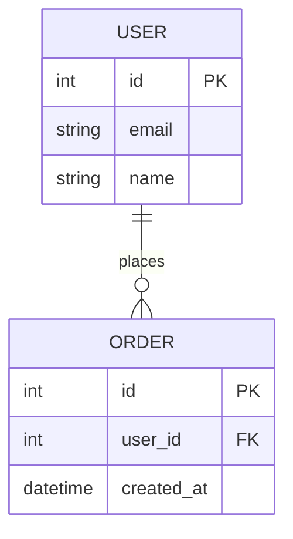

# サンプル図の作成例

このファイルは、Mermaid を使用した図の作成例を示します。

## 簡単なフローチャート

```mermaid
graph TD
    A[開始] --> B{条件判定}
    B -->|Yes| C[処理A]
    B -->|No| D[処理B]
    C --> E[終了]
    D --> E
```

## シーケンス図

```mermaid
sequenceDiagram
    participant User
    participant Frontend
    participant API
    
    User->>Frontend: リクエスト
    Frontend->>API: API呼び出し
    API-->>Frontend: レスポンス
    Frontend-->>User: 結果表示
```

## ER 図

```mermaid
erDiagram
    USER ||--o{ ORDER : places
    USER {
        int id PK
        string email
        string name
    }
    ORDER {
        int id PK
        int user_id FK
        datetime created_at
    }
```

これらの図は Markdown ファイル内で直接記述でき、GitHub で自動的にレンダリングされます。

詳細は [Mermaid ドキュメント](https://mermaid.js.org/) を参照してください。
